# Smart Parking Garage Slot Tracker

A full-stack web app for the **Digital Systems Design** microproject.
It simulates a 20-slot parking garage whose entry barrier is controlled by
Boolean logic, and shows the free-slot count on a 2-digit 7-segment display.

| Part     | Technology                          |
| -------- | ----------------------------------- |
| Frontend | React (Vite) + Tailwind CSS         |
| Backend  | Node.js + Express (REST API)        |
| Database | SQLite (Node's built-in `node:sqlite`, nothing to compile) |
| Logic    | `server/logic.js` (plain JavaScript) |

---

## Screenshots

### Dashboard

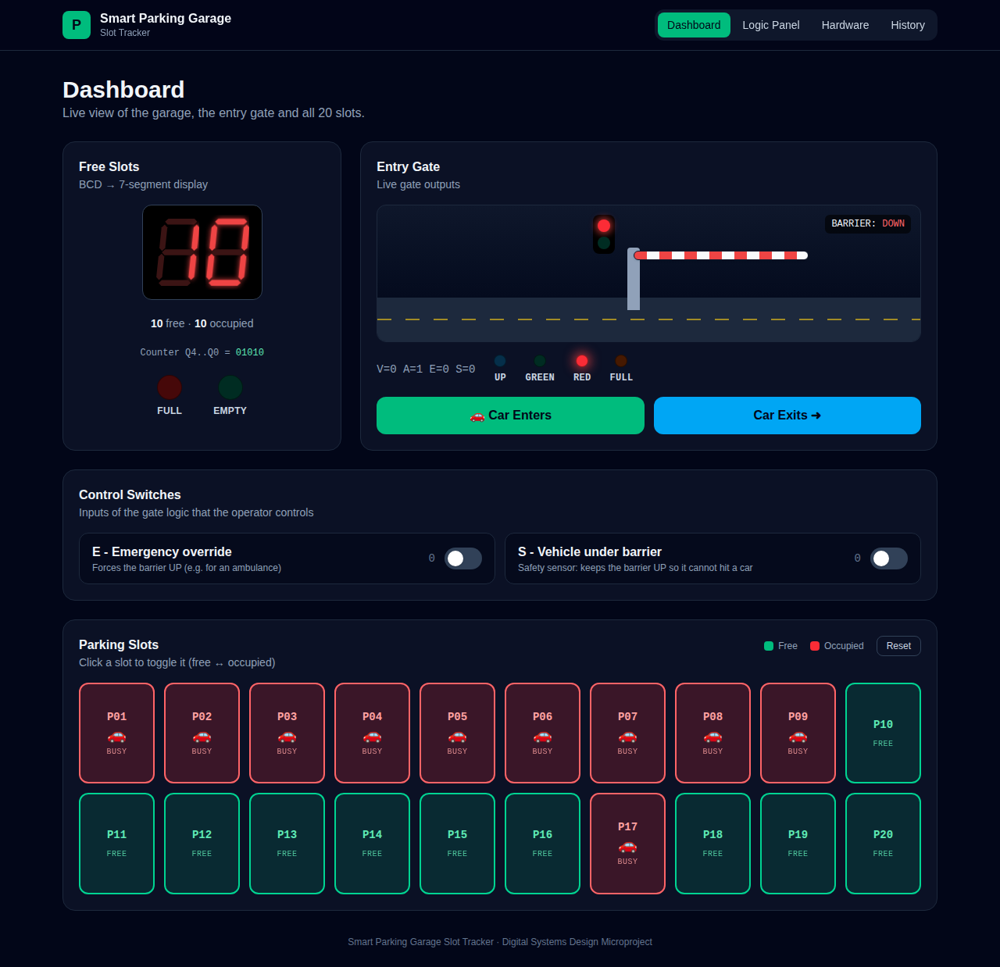

### A car entering

When **Car Enters** is clicked, the car stops at the gate (V = 1). The gate logic gives
UP = 1, so the barrier rises, the light turns green and the car parks in the first free slot.

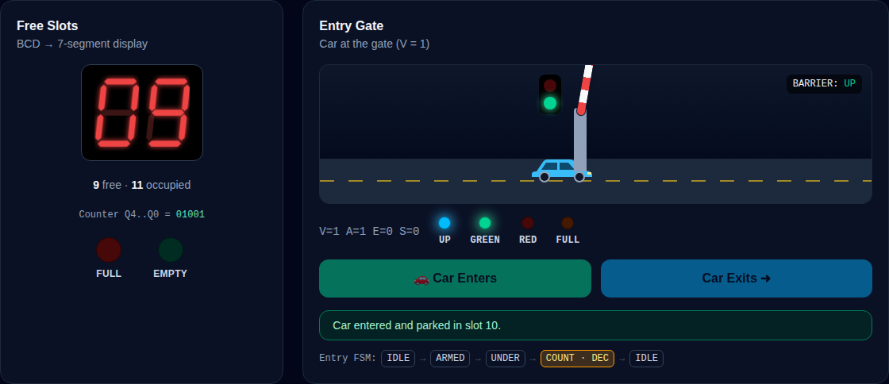

### Logic Panel

Live inputs and outputs, the equations with the current values filled in, the comparator
and BCD-to-7-segment decoder, and the truth table with the current row (12: V=1, A=1)
highlighted.

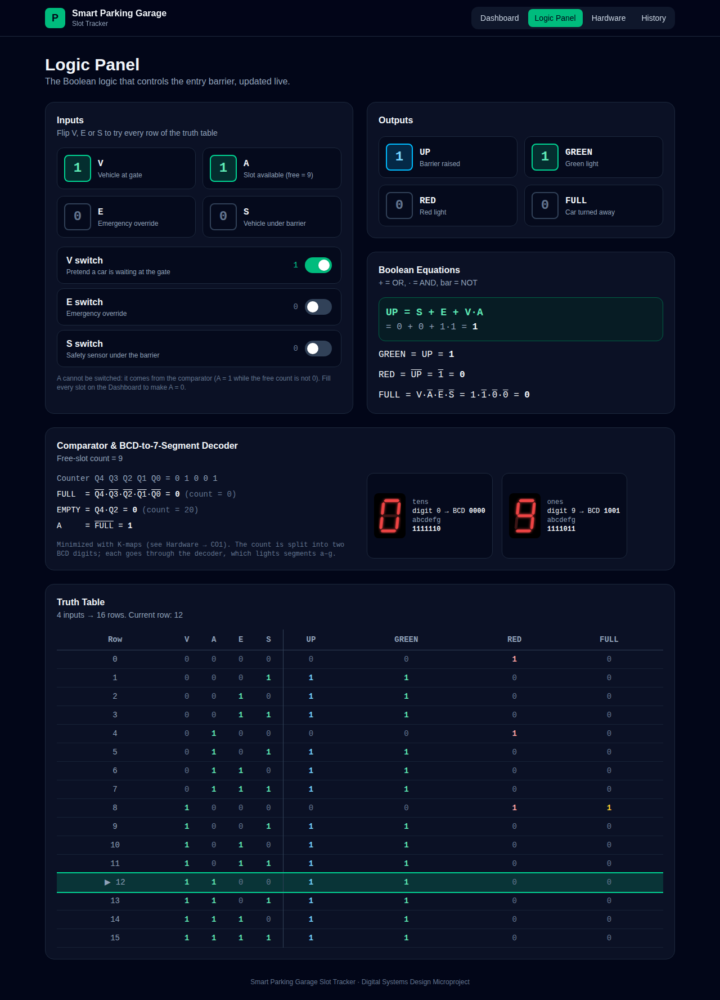

### Hardware Design (CO1, CO3, CO5)

**CO1: minimized comparator.** 5-variable K-maps for FULL and EMPTY. The X cells (counts 21–31
never happen) let EMPTY shrink to a single AND gate, `Q4·Q2`.

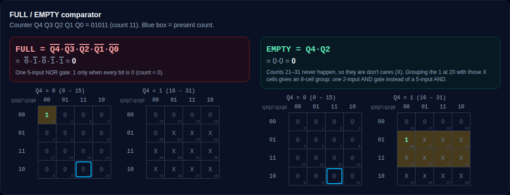

**CO1: minimized BCD-to-7-segment decoder.** Pick a segment, then click a product term to see its group.

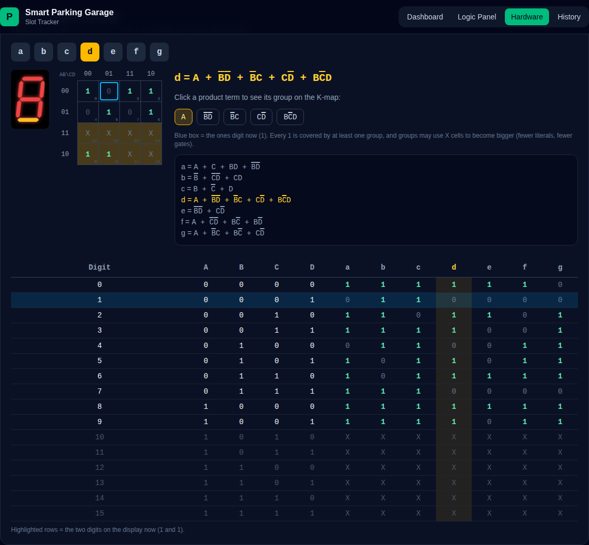

**CO3: synchronous up/down counter.** Live T flip-flops. The ringed ones had T = 1 and toggled on
the last clock, and the right-hand side previews the next clock in both directions.

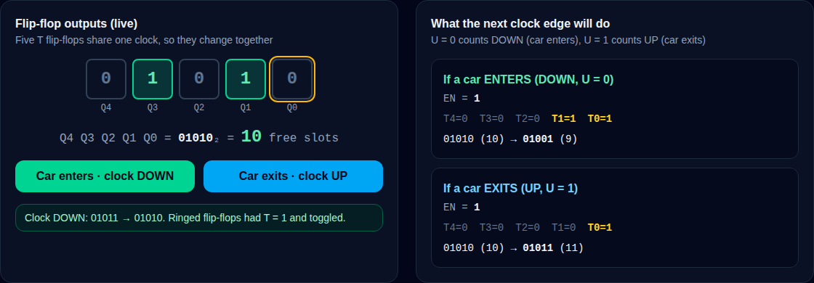

**CO5: Verilog FSM, debouncing and display multiplexing.**

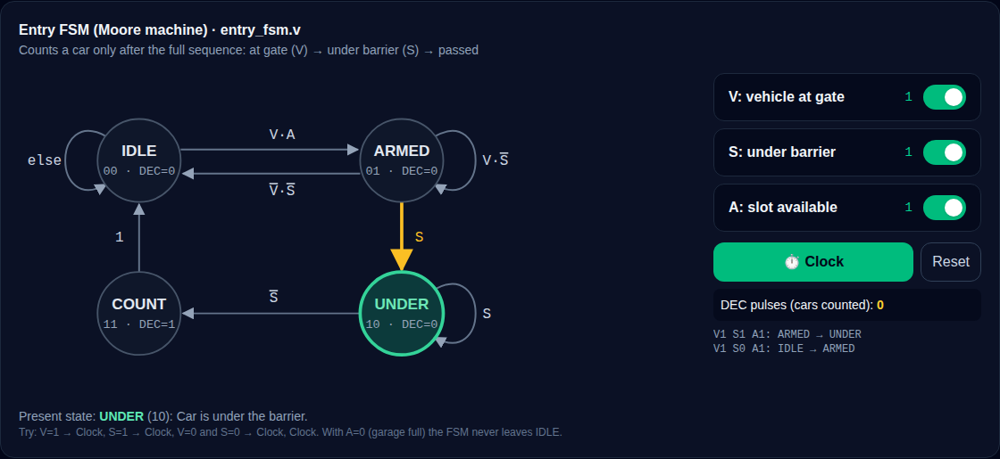

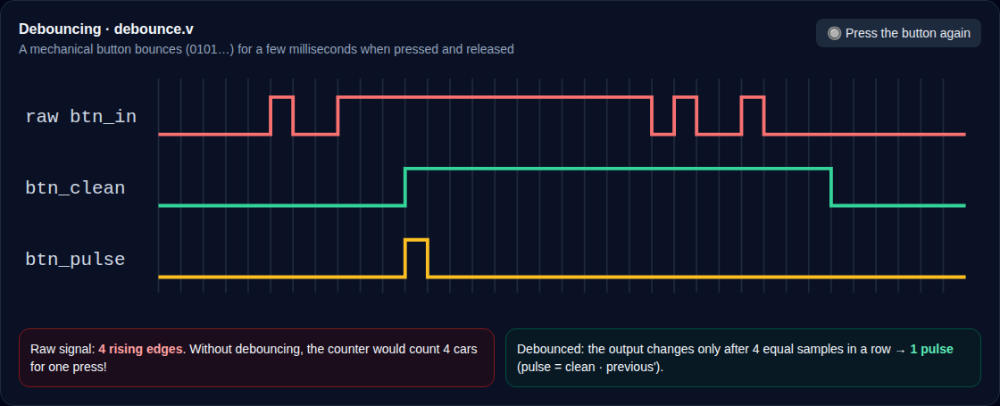

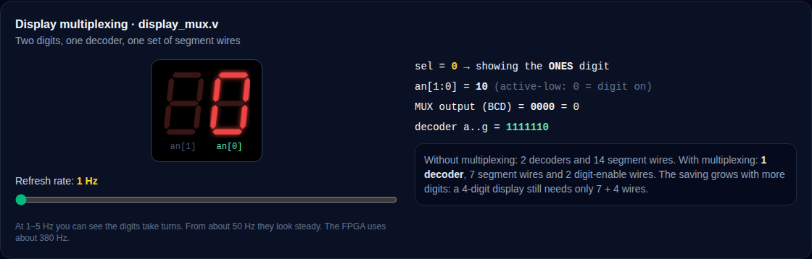

### History

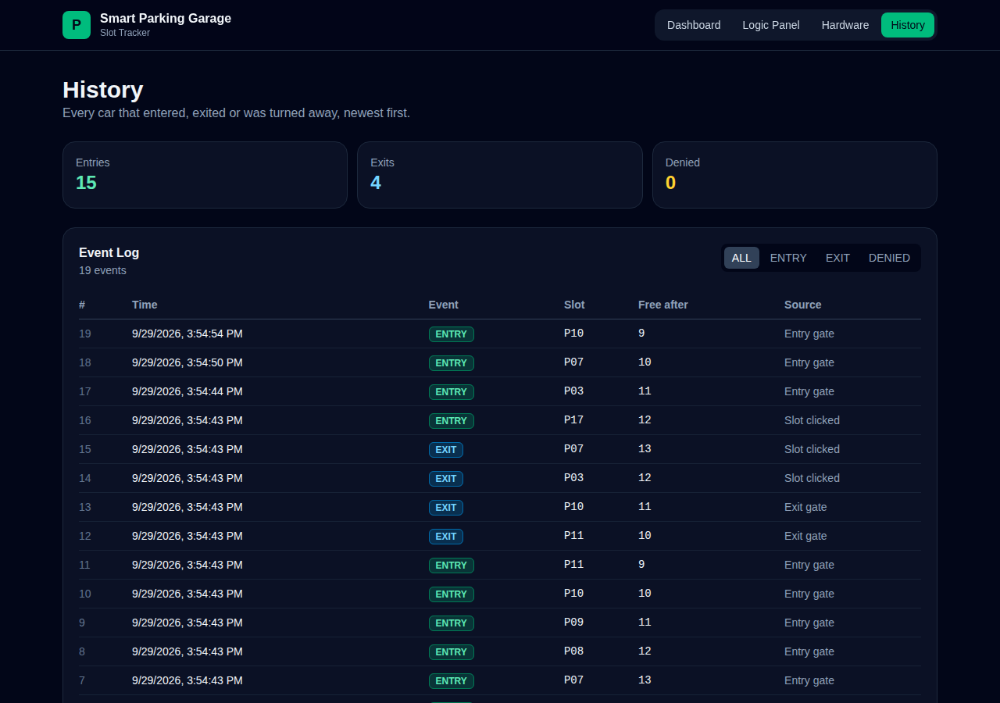

### On a phone

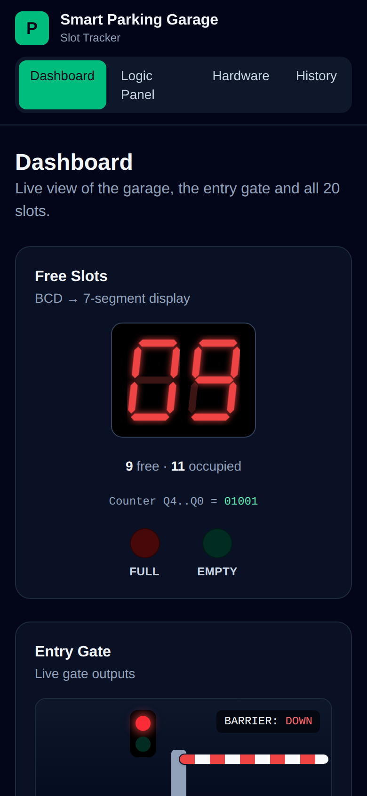

---

## Course outcomes covered

| CO | Where in the web app | Where in the code |
| --- | --- | --- |
| **CO1**: minimized combinational logic for FULL/EMPTY detection and the BCD-to-7-segment decoder | Hardware → CO1 (K-maps with don't cares, live values) | `server/logic.js` (`comparator`, `bcdTo7Segment`), `hardware/comparator.v`, `hardware/bcd_to_7seg.v` |
| **CO3**: synchronous up/down counter that tracks the number of free slots | Hardware → CO3 (live flip-flops, T equations, state table); every Car Enters / Exits clocks it | `server/logic.js` (`counterStep`), `hardware/updown_counter.v` |
| **CO5**: Verilog implementation with an FSM, debouncing and display multiplexing | Hardware → CO5 (FSM simulator, debounce waveform, multiplexing demo, Verilog source) | `hardware/*.v`, `server/logic.js` (`entryFsm`, `debounce`) |

The JavaScript in `server/logic.js` and the Verilog in `hardware/` implement the **same equations**.
Both are tested: `npm test` runs 9 JavaScript tests, and the Verilog testbench runs 177 checks
(see [`hardware/README.md`](hardware/README.md)).

---

## 1. Features

- **Dashboard**: 20 clickable slot boxes (green = free, red = occupied), a free-slot
  count on a 2-digit 7-segment display, FULL/EMPTY lamps, an animated barrier with a
  traffic light, **Car Enters** / **Car Exits** buttons, and **E** / **S** toggle switches.
- **Logic Panel**: live values of V, A, E, S and UP, GREEN, RED, FULL, the equation
  `UP = S + E + V·A` with the live values filled in, the comparator and BCD decoder
  outputs, and a 16-row truth table with the current row highlighted.
- **Hardware Design**: one tab per course outcome:
  - K-maps for the minimized comparator and decoder;
  - the T flip-flop up/down counter;
  - a clickable FSM simulator, a debounce timing diagram, a display-multiplexing demo, and the Verilog source.
- **History**: every entry, exit and refused car with its date and time, stored in SQLite.
- **Verilog (`hardware/`)**: the whole design as FPGA modules, with a self-checking testbench and Basys 3 pins.

---

## 2. Folder structure

```
Smart-Parking-Garage-Slot-Tracker/
├── package.json            # helper scripts to run everything from the root
├── check-install.js        # checks Node version + installed packages before "npm run dev"
├── docs/screenshots/       # the screenshots shown in this README
├── hardware/               # VERILOG (CO5): FSM, debounce, counter, comparator, decoder, mux, testbench
├── server/                 # BACKEND
│   ├── config.js           # CAPACITY = 20, port, database path
│   ├── logic.js            # gate logic, comparator, decoder, counter, FSM, debounce
│   ├── db.js               # SQLite tables + queries
│   ├── server.js           # Express REST API
│   ├── test/logic.test.js  # unit tests for logic.js
│   └── data/parking.db     # created automatically on first run
└── client/                 # FRONTEND
    ├── index.html
    ├── vite.config.js      # forwards /api requests to the server
    └── src/
        ├── main.jsx, App.jsx, index.css
        ├── api.js                  # all fetch() calls to the backend
        ├── hooks/useParkingStatus.js  # loads /api/status every 2 s
        ├── components/             # NavBar, SevenSegment, Barrier, SlotGrid, ...
        │   └── hardware/           # K-map, counter, FSM, debounce and mux views
        └── pages/                  # Dashboard, LogicPanel, Hardware, History
```

---

## 3. Setup and run (step by step)

### Step 1: Install Node.js

Install **Node.js 22 LTS (22.13 or newer) or Node.js 24** from <https://nodejs.org>. Check it:

```bash
node -v    # should print v22.13.0 or higher (v24 is fine)
npm -v
```

### Step 2: Get the project

```bash
git clone https://github.com/KrisJeffordImmanuvel/Smart-Parking-Garage-Slot-Tracker.git
cd Smart-Parking-Garage-Slot-Tracker
```

(No Git? On the GitHub page click **Code → Download ZIP**, unzip it, and open PowerShell or a
terminal inside the unzipped folder.)

> **Important:** every `npm run ...` command below must be run **inside the
> `Smart-Parking-Garage-Slot-Tracker` folder** (the one that contains `package.json`,
> `client` and `server`). If you see `ENOENT ... Could not read package.json`, you are
> in the wrong folder, so `cd` into the project folder first.

### Step 3: Install all dependencies

```bash
npm install
```

This one command installs the packages for the root folder **and** for `server/` and
`client/`. Wait until it finishes and ends with `found 0 vulnerabilities` (or similar) and no
red `npm error` lines.

### Step 4: Start the app

**Option A: one command (recommended)**

```bash
npm run dev
```

This starts the backend on <http://localhost:4000> and the frontend on
<http://localhost:5173>. Open **<http://localhost:5173>** in your browser.

> Port **4000** is only the backend API. Opening it in the browser shows a small help
> page, not the app. Always use **5173** while `npm run dev` is running, and keep the
> terminal open. Closing it stops the site.

**Option B: two terminals**

```bash
# Terminal 1: backend
cd server
npm run dev

# Terminal 2: frontend
cd client
npm run dev
```

Then open <http://localhost:5173>.

### Other useful commands

```bash
npm test         # run the unit tests for logic.js
npm run build    # build the React app into client/dist
npm start        # after a build: serve app + API together on http://localhost:4000
```

To start again with an empty garage, click **Reset** on the Dashboard, or stop the
server and delete the `server/data` folder.

To simulate the Verilog design (needs [Icarus Verilog](https://bleyer.org/icarus/)),
follow [`hardware/README.md`](hardware/README.md). It also covers running the design on a
Basys 3 FPGA with Vivado.

---

## 4. REST API

Base URL: `http://localhost:4000`

| Method | Route              | What it does                                                         |
| ------ | ------------------ | -------------------------------------------------------------------- |
| GET    | `/api/status`      | Free count, all 20 slot states, FULL, EMPTY, inputs and gate outputs |
| POST   | `/api/enter`       | A car enters (free count − 1, never below 0)                         |
| POST   | `/api/exit`        | A car exits (free count + 1, never above 20)                         |
| POST   | `/api/slot/:id`    | Toggle slot `id` (1–20) between occupied and free                    |
| POST   | `/api/switch`      | Set switches, body e.g. `{ "E": 1, "S": 0 }` (V is also accepted)    |
| GET    | `/api/history`     | List of entry/exit events with time (newest first)                   |
| GET    | `/api/truth-table` | Extra: the 16-row truth table generated by `logic.js`                |
| POST   | `/api/reset`       | Extra: free all slots, switches off, clear history                   |
| GET    | `/api/design`      | K-maps, minimized equations, counter state table, FSM states         |
| POST   | `/api/fsm/step`    | One clock of the entry FSM, body `{ "state": "IDLE", "V": 1, "A": 1, "S": 0 }` |
| GET    | `/api/debounce-demo` | A simulated bouncing button press and its debounced output        |
| GET    | `/api/verilog`     | The Verilog files from `hardware/`                                   |

Try it from a terminal:

```bash
curl http://localhost:4000/api/status
curl -X POST http://localhost:4000/api/enter
curl -X POST -H "Content-Type: application/json" -d '{"E":1}' http://localhost:4000/api/switch
```

Example `/api/status` response (shortened):

```json
{
  "capacity": 20,
  "freeCount": 17,
  "occupiedCount": 3,
  "slots": [{ "id": 1, "occupied": 1 }, { "id": 2, "occupied": 0 }],
  "FULL": 0,
  "EMPTY": 0,
  "inputs": { "V": 0, "A": 1, "E": 0, "S": 0 },
  "gate": { "UP": 0, "GREEN": 0, "RED": 1, "FULL": 0 },
  "display": {
    "tens": { "digit": 1, "bcd": "0001", "segments": { "a": 0, "b": 1, "c": 1, "d": 0, "e": 0, "f": 0, "g": 0 } },
    "ones": { "digit": 7, "bcd": "0111", "segments": { "a": 1, "b": 1, "c": 1, "d": 0, "e": 0, "f": 0, "g": 0 } }
  }
}
```

---

## 5. The digital logic (`server/logic.js`)

### Inputs

| Signal | Meaning               | Where it comes from                              |
| ------ | --------------------- | ------------------------------------------------ |
| V      | Vehicle at gate       | Car Enters button (or the V switch on Logic Panel) |
| A      | Slot available        | Comparator: 1 when the free count is not 0       |
| E      | Emergency override    | E switch                                         |
| S      | Vehicle under barrier | S switch (safety sensor)                         |

### Boolean equations

```
UP    = S + E + V·A
GREEN = UP
RED   = UP'
FULL  = V·A'·E'·S'
```

(`+` = OR, `·` = AND, `'` = NOT). In JavaScript they are written with `||`, `&&` and `!`:

```js
const UP = S || E || (V && A);
const FULL = V && !A && !E && !S;
```

### Truth table

| V | A | E | S | UP | GREEN | RED | FULL |
|---|---|---|---|----|-------|-----|------|
| 0 | 0 | 0 | 0 | 0  | 0     | 1   | 0    |
| 0 | 0 | 0 | 1 | 1  | 1     | 0   | 0    |
| 0 | 0 | 1 | 0 | 1  | 1     | 0   | 0    |
| 0 | 0 | 1 | 1 | 1  | 1     | 0   | 0    |
| 0 | 1 | 0 | 0 | 0  | 0     | 1   | 0    |
| 0 | 1 | 0 | 1 | 1  | 1     | 0   | 0    |
| 0 | 1 | 1 | 0 | 1  | 1     | 0   | 0    |
| 0 | 1 | 1 | 1 | 1  | 1     | 0   | 0    |
| 1 | 0 | 0 | 0 | 0  | 0     | 1   | **1** |
| 1 | 0 | 0 | 1 | 1  | 1     | 0   | 0    |
| 1 | 0 | 1 | 0 | 1  | 1     | 0   | 0    |
| 1 | 0 | 1 | 1 | 1  | 1     | 0   | 0    |
| 1 | 1 | 0 | 0 | 1  | 1     | 0   | 0    |
| 1 | 1 | 0 | 1 | 1  | 1     | 0   | 0    |
| 1 | 1 | 1 | 0 | 1  | 1     | 0   | 0    |
| 1 | 1 | 1 | 1 | 1  | 1     | 0   | 0    |

Row number = V·8 + A·4 + E·2 + S (the inputs read as a 4-bit binary number).

### Comparator (CO1, minimized)

The free count lives in a 5-bit counter `Q4 Q3 Q2 Q1 Q0`:

- `FULL  = Q4'·Q3'·Q2'·Q1'·Q0'`: 1 only when the count is 0 (a 5-input NOR gate).
- `EMPTY = Q4·Q2`: 1 when the count is 20 (`10100`). Counts 21–31 never happen, so they are
  **don't cares**. Among 0–20, only 20 has both Q4 = 1 and Q2 = 1.
- `A = FULL'` (a slot is available whenever the garage is not full).

The comparator's FULL is the **garage full** lamp. The gate's FULL output is different:
it is 1 only when a car is actually **waiting** and gets turned away.

### BCD-to-7-segment decoder

The free count (0–20) is split into two BCD digits, e.g. `17` gives tens `0001` and
ones `0111`. Each digit `A B C D` goes through minimized equations, using codes 10–15
as don't cares:

```
a = A + C + BD + B'D'          e = B'D' + CD'
b = B' + C'D' + CD             f = A + C'D' + BC' + BD'
c = B + C' + D                 g = A + B'C + BC' + CD'
d = A + B'D' + B'C + CD' + BC'D
```

A unit test checks these equations against the decoder's truth table for every digit.
The frontend only draws the segments that the decoder turned on.

### Up/down counter (CO3)

Five T flip-flops share one clock (synchronous). `U = 1` counts up (a car exits) and
`U = 0` counts down (a car enters). A T flip-flop toggles when `T = 1`: `Q(next) = Q ⊕ T`.

```
EN = U·EMPTY' + U'·FULL'                 (stop at 20 going up, at 0 going down)
T0 = EN
T1 = EN·(U·Q0 + U'·Q0')
T2 = EN·(U·Q0·Q1 + U'·Q0'·Q1')
T3 = EN·(U·Q0·Q1·Q2 + U'·Q0'·Q1'·Q2')
T4 = EN·(U·Q0·Q1·Q2·Q3 + U'·Q0'·Q1'·Q2'·Q3')
```

### Entry FSM, debouncing and multiplexing (CO5)

- **Entry FSM (Moore):** `IDLE (00) → ARMED (01) → UNDER (10) → COUNT (11) → IDLE`. It moves to
  ARMED only when `V·A = 1`, to UNDER when `S = 1`, and to COUNT when `S = 0`. COUNT outputs one
  `DEC` pulse, which clocks the counter down. A car that reverses away, or arrives when the garage
  is full, is never counted.
- **Debouncing:** a 2-flip-flop synchronizer, then a counter. The output only changes after the
  input has been stable for N clocks. A one-pulse circuit then gives one clock-wide pulse per press.
- **Display multiplexing:** both digits share one decoder and the same 7 segment wires. A
  select signal switches between the tens and ones digit hundreds of times per second.

---

## 6. How the parts work together

1. **Frontend (React)**: The pages call the API through `client/src/api.js`. The
   `useParkingStatus` hook fetches `/api/status` every 2 seconds, so the screen
   always shows the latest data. Clicking a button sends a POST request, and the
   response already contains the new status, so the screen updates at once.
2. **Backend (Express)**: `server.js` receives the request, reads and updates SQLite
   through `db.js`, then runs the data through `logic.js` (comparator → gate logic →
   BCD decoder) and sends everything back as JSON.
3. **Database (SQLite)**: `slots` holds the 20 slot states, `switches` holds V, E and S,
   and `history` logs every event with its time. The free count is always calculated
   by counting free slots, so it can never disagree with the slot boxes.

### What happens when you click "Car Enters"

1. The car drives up to the barrier, which means **V = 1**.
2. The server works out `A` from the free count and evaluates `UP = S + E + V·A`.
3. The **entry FSM** runs through the sensor sequence (V → S → passed). If `A = 1`, it
   goes `IDLE → ARMED → UNDER → COUNT` and produces one **DEC** pulse.
4. The DEC pulse clocks the **up/down counter DOWN** by one. The car parks in the first
   free slot, and an **ENTRY** is logged. The barrier rises and the car drives in.
5. If **UP = 0** (garage full, no override), the gate's **FULL = 1**, the barrier stays
   down, the car turns back, and a **DENIED** event is logged.
6. If E or S force the barrier up but no slot is free, the FSM never arms (A = 0), so
   there is no DEC pulse and the count stays at 0. The event is logged as **DENIED**.

**Car Exits** clocks the counter **UP**. Its enable `EN = U·EMPTY'` stops it at 20.

---

## 7. Troubleshooting

| Problem                                   | Fix                                                                      |
| ----------------------------------------- | ------------------------------------------------------------------------ |
| `ENOENT: Could not read package.json`     | You are not in the project folder. `cd Smart-Parking-Garage-Slot-Tracker` and run the command again. |
| "Cannot reach the server" on the page     | The backend is not running. Start it (`npm run dev`).                    |
| `EADDRINUSE: port 4000` or `5173`         | Another program uses that port. Close it, or set `PORT=4001` for the server and change the proxy in `client/vite.config.js`. |
| `Cannot find module 'express'` or `'vite' is not recognized` | The server/client packages are not installed. Run `npm install` in the project folder and let it finish. |
| Want a fresh garage                       | Click **Reset** on the Dashboard, or delete `server/data/`.              |
